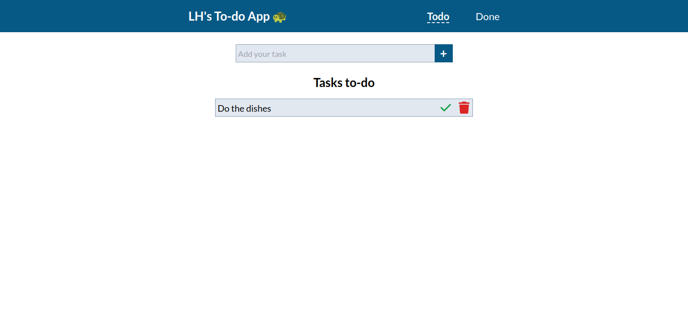
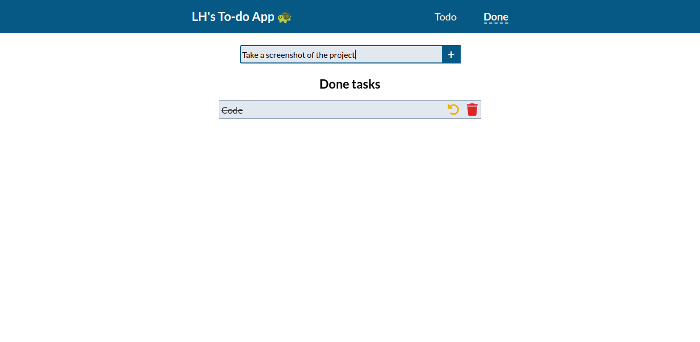

# nuxt-todo-app 

A To-do App build with TailwindCSS and Nuxt 3.

## Table of contents

- [Overview](#overview)
  - [The project](#the-project)
  - [Screenshot](#screenshot)
  - [Links](#links)
- [Process](#process)
  - [Built with](#built-with)
- [Author](#author)

## Overview

### The project

A common to-do app, made with Nuxt.js 3 and TailwindCSS. Users can add, edit, mark as done/to-do (each list has it separate page) and delete the tasks. All the tasks are saved in localStorage. It also uses Vue Router, so the user can navigate between the index (to-do tasks) and done (obviously, done tasks) pages without the page reload.  

### Screenshot

### Links

- [Live Site URL](https://todo-app-luizhf42.vercel.app/)

## Process

### Built with

- HTML5
- CSS3
- TailwindCSS
- TypeScript
- Vue.js
- Nuxt.js 3

## Author

- [Luiz Henrique Felix. 🐢](https://www.linkedin.com/in/luiz-henrique-felix)

